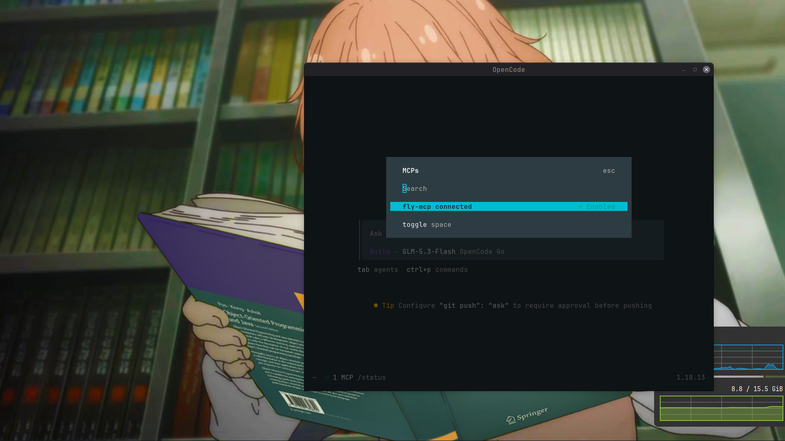
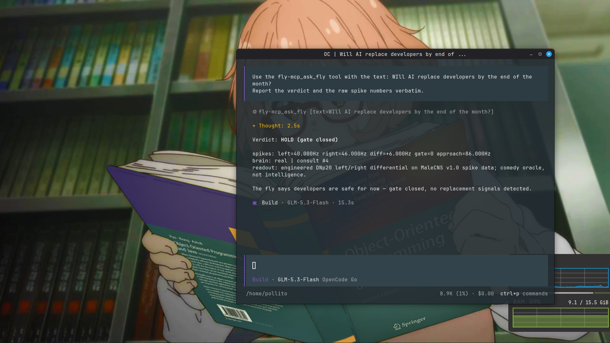

# fly-mcp

A MaleCNS v1.0 fly brain behind MCP tools. Ask the fly a question, it reads its connectome, and a verdict comes back. The server speaks remote Streamable-HTTP MCP, so any agent that supports remote MCP can consult it.

The brain is the MaleCNS v1.0 connectome that Google Research and HHMI Janelia released in September 2026, run through [Stonkfly](https://github.com/nftechie/stonkfly) (MIT) at a pinned commit. The decoder, the frames, and the reinforcement signals are engineered. None of it is cognition.

## Honesty, read before sharing any result

- The connectome weights are anatomy, not a living fly.
- The verdict is Stonkfly's DNp20 left/right spike differential with a DNpe017 gate. It is an engineered mapping, not a discovered decision circuit.
- `reward_fly` and `punish_fly` queue engineered pulses (15 PAM11 dopaminergic cells, 2 PPL101 aversive cells). They are not modeled pleasure or pain.
- Frames are light-background 320x180 RGB renders of your text. That is a display adapter, not retinal physiology. Dark frames barely activate the connectome, which is why the background stays light.
- The likely outcome is a HOLD. That is a valid, honest result.

Every tool description carries the same line: engineered readout on spike data, comedy oracle, not intelligence.

## The MCP surface

Tools:

- `ask_fly(text)`: renders the text as a frame and returns the verdict (BUY/SELL/HOLD) plus raw spike stats.
- `reward_fly(reason)`: queues a reward pulse, consumed by the next `ask_fly`, not at call time.
- `punish_fly(reason)`: queues an aversive pulse, consumed by the next `ask_fly`, not at call time.
- `fly_vitals()`: brain kind, consult count, memory stats.

Resource: `fly://vitals` (JSON). Prompt: `second-opinion(question, context?)`.

## Layout

```
src/        Spring Boot 4.1 + Spring AI 2.0.1 MCP server (Java 25)
oracle/     FastAPI sidecar wrapping Stonkfly's stonkfly.neural package
infra/      Terraform: one disposable GCP VM, firewall from one source CIDR
compose.yml prepare -> oracle -> warmup -> mcp
```

The MCP server has two backends. `MockBrainBackend` is the default when `FLYBRAIN_BASE_URL` is unset: deterministic scores from frame bytes plus a call counter, no clocks, no randomness. `HttpBrainBackend` calls the oracle when `FLYBRAIN_BASE_URL` points at it.

## Run locally with the mock brain

No dataset, no GCP, no tokens.

```bash
FLY_BRAIN=mock docker compose up -d --build
```

Then list the surface:

```bash
npx -y @modelcontextprotocol/inspector --cli http://localhost:8080/mcp --method tools/list
npx -y @modelcontextprotocol/inspector --cli http://localhost:8080/mcp --method tools/call \
  --tool-name ask_fly --tool-arg 'text=Does this thing work?'
```

The repo ships `opencode.json` pointing `fly-mcp` at `http://localhost:8080/mcp`. Run `opencode mcp list` from the repo root and the server shows as connected.

Java only loop:

```bash
./gradlew test          # renderer, mock backend, HTTP backend, MCP surface
./gradlew bootRun       # starts with the mock backend on :8080
```

## Deploy to GCP

Prerequisites: a GCP project with billing enabled, `gcloud` authenticated, and Terraform installed. On NixOS without Terraform, fetch the static binary:

```bash
mkdir -p /tmp/tf && curl -fsSL -o /tmp/tf/tf.zip https://releases.hashicorp.com/terraform/1.14.0/terraform_1.14.0_linux_amd64.zip
unzip -o /tmp/tf/tf.zip -d /tmp/tf && mv /tmp/tf/terraform /tmp/terraform && chmod +x /tmp/terraform
```

Apply, passing the one CIDR that may reach port 8080:

```bash
cd infra
terraform init
terraform apply -var="allowed_source_cidr=$(curl -4 -s ifconfig.me)/32"
```

The VM installs Docker, clones this public repo, writes `.env`, and runs compose. The prepare service downloads the MaleCNS dataset and builds the graph, under two minutes on this run. The warmup service then runs one throwaway consult so the connectome and the LIF kernel load before the MCP server starts. Watch progress over SSH:

```bash
gcloud compute ssh fly-mcp --zone=europe-west4-a --command='sudo docker compose -f /opt/fly-mcp/compose.yml ps'
```

Register the server in opencode and check it:

```bash
opencode mcp add fly-mcp --url "http://$(terraform output -raw instance_ip):8080/mcp"
opencode mcp list
opencode mcp debug fly-mcp
```

Destroy everything when the window closes:

```bash
terraform destroy
```

Cost: an on-demand `e2-highmem-4` in `europe-west4` runs about $0.20 per hour plus disk. A few hours stays under $1. The MCP endpoint is unauthenticated, by design for this POC. The firewall source CIDR is the only access control, so keep the window in minutes and destroy when done.

If the connection is refused, check two things first: whether the laptop dialed IPv6 while the rule is IPv4, and whether the public IP changed since the apply.

## POC evidence: one real consult

On 2026-09-16 the real stack ran on a disposable GCP VM, and an opencode session consulted it. This is the full run, command by command. The external IP is replaced with `<ephemeral-ip>`.

### Bring the stack up

```bash
cd infra
terraform init
terraform apply -var="allowed_source_cidr=$(curl -4 -s ifconfig.me)/32"
```

```
Apply complete! Resources: 2 added, 0 changed, 0 destroyed.

Outputs:

instance_ip          = "<ephemeral-ip>"
mcp_url              = "http://<ephemeral-ip>:8080/mcp"
opencode_add_command = "opencode mcp add fly-mcp --url http://<ephemeral-ip>:8080/mcp"
```

The VM boots, downloads the dataset, loads the connectome, and compiles the kernel. The MCP server starts only after the warmup. Block until it finishes:

```bash
until gcloud compute ssh fly-mcp --zone=europe-west4-a --command='sudo docker compose -f /opt/fly-mcp/compose.yml logs warmup 2>/dev/null | grep -q "warmup ok"'; do sleep 60; done; echo READY
```

```
READY
```

The warmup container prints one line and exits:

```bash
gcloud compute ssh fly-mcp --zone=europe-west4-a --command='sudo docker compose -f /opt/fly-mcp/compose.yml logs --tail 3 warmup'
```

```
warmup-1  | warmup ok: side=BUY brain_kind=real consults=1
```

Pre-flight from the MCP inspector, before any agent session:

```bash
npx -y @modelcontextprotocol/inspector --cli http://<ephemeral-ip>:8080/mcp --method tools/call --tool-name ask_fly --tool-arg 'text=Pre-flight check'
```

```json
{
  "content": [
    {
      "type": "text",
      "text": "verdict: BUY (gate open)\nspikes: left=30.000Hz right=42.000Hz diff=+12.000Hz gate=1 approach=72.000Hz\nbrain: real | consult #2\nreadout: engineered DNp20 left/right differential on MaleCNS v1.0 spike data; comedy oracle, not intelligence."
    }
  ],
  "isError": false
}
```

### Connect opencode

```bash
opencode mcp add fly-mcp --url "http://<ephemeral-ip>:8080/mcp"
opencode mcp list
opencode mcp debug fly-mcp
```

```
◆  MCP server "fly-mcp" added to ~/.config/opencode/opencode.jsonc
```

```
┌  MCP Servers
│
●  ✓ fly-mcp connected
│      http://<ephemeral-ip>:8080/mcp
│
└  1 server(s)
```

The TUI MCPs dialog shows the same server:



```
◆  Server responded successfully (no auth required or already authenticated)
●  Server info: {"name":"fly-mcp","version":"0.1.0"}
```

### Ask the fly

Timeline in UTC:

| Time | Event |
|------|-------|
| 12:13:18 | prepare starts on the VM: dataset download and graph build. |
| 12:15:07 | Warmup consult completes on the real connectome. Compose starts the MCP server only after this. |
| 12:18:29 | Pre-flight consult from the MCP inspector. The reply reads `brain: real`. |
| 12:24:31 | First TUI attempt. opencode cancels the request after the oracle completes, so no result is shown. |
| 12:27:25 | Retry starts. |
| 12:27:33.473 | The oracle access log records `POST /consult 200` for consult #4. |
| 12:27:33.521 | opencode records the completed tool result. |

Compose started prepare at 12:13:18 and the warmup finished at 12:15:07, under two minutes.

The first attempt is in the timeline on purpose. opencode cancelled a slow call, and the retry worked. Multi-second consults can end this way.

The question and verdict from the retry:



The completed record as stored in opencode's session database:

```json
{
  "tool": "fly-mcp_ask_fly",
  "input":  { "text": "WIll AI replace developers by the end of the month?" },
  "output": "verdict: HOLD (gate closed)\nspikes: left=40.000Hz right=46.000Hz diff=+6.000Hz gate=0 approach=86.000Hz\nbrain: real | consult #4\nreadout: engineered DNp20 left/right differential on MaleCNS v1.0 spike data; comedy oracle, not intelligence.",
  "duration_ms": 8160
}
```

opencode stores every session in `~/.local/share/opencode/opencode-stable.db`. Extract the newest completed fly result with:

```bash
python3 - <<'EOF'
import sqlite3, os, json
p = os.path.expanduser('~/.local/share/opencode/opencode-stable.db')
con = sqlite3.connect('file:' + p + '?mode=ro', uri=True)
row = con.execute(
    "select data from part where data like '%fly-mcp_ask_fly%'"
    " and data like '%completed%' order by time_created desc limit 1").fetchone()
d = json.loads(row[0])
print(json.dumps({'tool': d['tool'], 'input': d['state']['input'],
                  'output': d['state']['output'], 'time': d['state']['time']}, indent=2))
EOF
```

The VM logs prove the request arrived but cannot show its content. The question becomes a PNG inside the MCP server, and the oracle logs neither frames nor responses. Use the oracle access log for the timestamp correlation:

```bash
gcloud compute ssh fly-mcp --zone=europe-west4-a \
  --command='sudo docker compose -f /opt/fly-mcp/compose.yml logs --timestamps oracle 2>/dev/null | grep "POST /consult"'
```

```
oracle-1  | 2026-09-16T12:27:33.473501110Z INFO: 172.18.0.x:40042 - "POST /consult HTTP/1.1" 200 OK
```

The client record ends 48 milliseconds after the oracle logged the request, so both sides agree on the same interaction.

### Tear down

```bash
terraform destroy -var="allowed_source_cidr=$(curl -4 -s ifconfig.me)/32"
```

```
Destroy complete! Resources: 2 destroyed.
```

## Backlog, not in scope

Spring Security bearer auth, TLS with a domain, a second remote consumer, and a stdio transport. The POC runs one transport only: remote Streamable-HTTP.

## Credits

- [Stonkfly](https://github.com/nftechie/stonkfly) (MIT): the MaleCNS v1.0 event-driven LIF kernel, visual adapter, decoder, and reinforcement scaffolding. Vendored at commit `78ef3e05ab0fa086032098558d893667068944a0`.
- [MaleCNS v1.0](https://male-cns.janelia.org/): Google Research and HHMI Janelia, open connectome, source files downloaded under the upstream license.
- [Spring AI](https://docs.spring.io/spring-ai/reference/): MCP server boot starter and annotations.

Nothing here is neuroscience research or investment advice.
